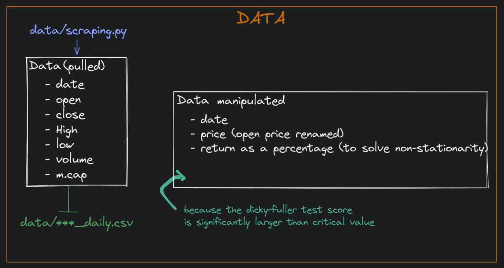
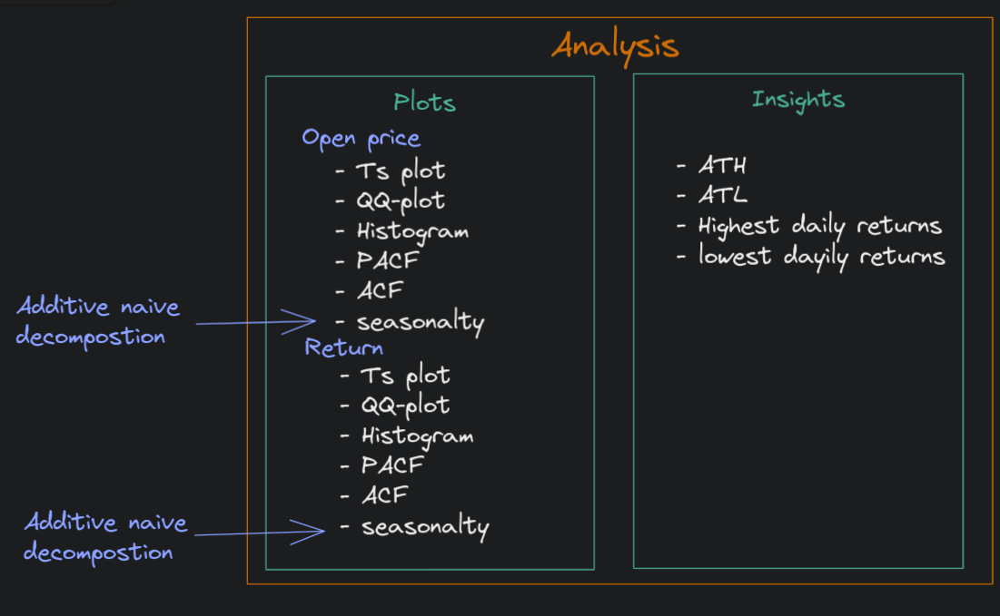
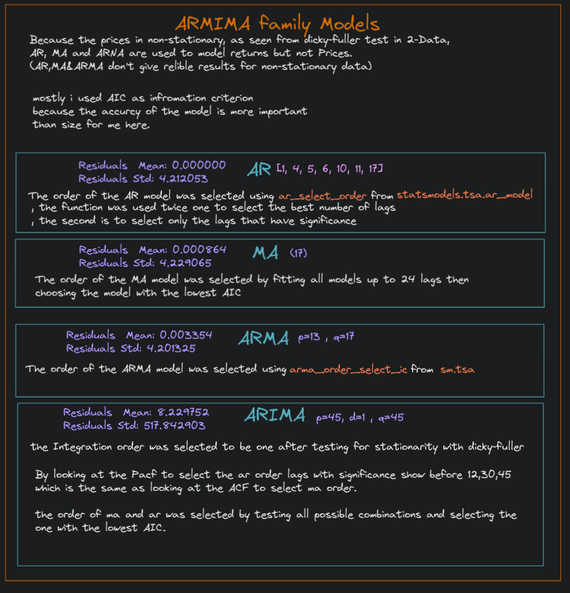
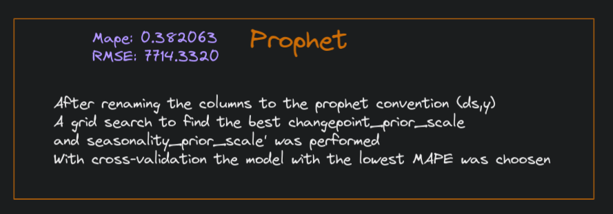

# `Project’s title: Crypto Analysis and Univariate forcasting`

## Data 
The data source is coinmarketcap web-api


## Analysis


## Arima



## Prophet


## Demo


## Files:
```

    ├── app.py
    ├── Mainnotebook.ipynb
    ├── predictions.csv
    ├── README.md
    ├── requirements.txt
    |
    ├── assets
    │   ├── analysis.png
    │   └── data.png
    |
    ├── analysis
    │   ├── __init__.py
    │   ├── acf_pacf_plot.py
    │   ├── hist_plot.py
    │   ├── qq_plot.py
    │   └── seasonal_decomp.py
    |
    ├── data
    │   ├── __init__.py
    │   ├── scraping_script.py
    │   ├── data_cleaning.py
    │   ├── ada_daily.csv
    │   ├── btc_daily.csv
    │   ├── eth_daily.csv
    │   ├── ftm_daily.csv
    │   ├── matic_daily.csv
    │   └── xrp_daily.csv
    |
    ├── models
    │   ├── __init__.py
    │   ├── arima_res.py
    │   ├── arima.ipynb
    │   ├── prophet.ipynb
    │   └── saved
    │       └── prophet_serialized_model.json
    |
    └── streamlit_funcs
        ├── arima_st.py
        ├── insights.py
        └── prophet_res.py
```

## Requirements.txt:
```
     matplotlib==3.5.3
     numpy==1.23.1
     pandas==1.4.4
     plotly==5.9.0
     prophet==1.1.1
     requests==2.28.1
     scipy==1.8.1
     statsmodels==0.13.2
     streamlit==1.11.0

```
## To run the app :
```
    
     git clone https://github.com/obaidagh/crypto-analysis-forcasting

     cd crypto-analysis-forcasting

     conda create -n crypto_st python=3.10.6

     conda activate crypto_st

     pip3 install -r requirements.txt

     streamlit run app.py     

```

## How i will improve the project:
Because the high volitale nature of cryptocurrencies with no seasonality , no exogenous variables and the models having high bias<br>
the models failed to have high accuracy.
```
1- increase models complexity or change the models hypothesis set
2- add Deep learining models(Neural Prophet, LSTM)
3- add exagones variables
    a- US intrest rate
    b- s&P 500 returns
    c- feature extraction(rolling mean,rolling std,volume,rolling volume)
```

